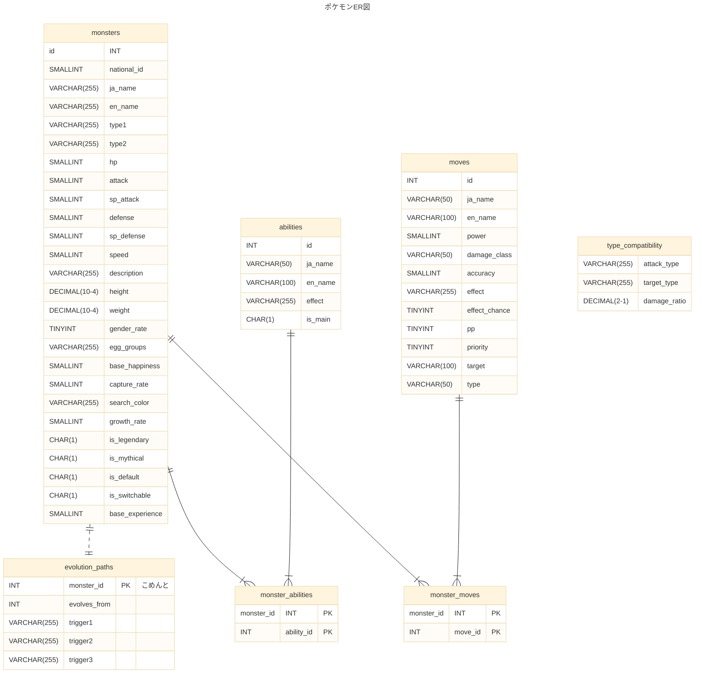

# DB設計メモ

* MySQL

## DDLメモ
https://note.shiftinc.jp/n/nc0a0dc56d609
* unsigned  
  INTで負数を使えなくする分、正数のを増やす設定
* utf8mb4  
  UTF-8は1～4バイトで、バイトと文字を対応付ける仕組み。  
  なぜかMySQLのutf8は1～3バイトしか保存できない型として定義されており、絵文字などを入れられないという仕様になっている。  
  そこでちゃんと世界の基準にあっているutf8mb4（1～4バイトまで格納可能な型）が存在しており、基本的にはこれをカラムの型に指定する。
* CAHARACTER SET　utf8mb4  
  文字コード設定  
  設定の適用
* DEFAULT CHARSET=utf8mb4  
  テーブルの文字コードのデフォルトを設定する
  各カラムに"CAHARACTER SET　utf8mb4"を記載する必要がなくなる。
* COLLATE utf8mb4_unicode_ci
  文字列の比較やソート順のルールを設定。
* ENGINE=InnoDB  
  MySQLでは複数のストレージエンジンをサポートしているため選択可能  
* DEFAULT CURRENT_TIMESTAMP ON UPDATE CURRENT_TIMESTAMP  
  INSERT時・UPDATE時に現在時刻に更新。
## 外部制約
* 存在しない値を外部キーとして登録できなくなる
* 外部キーとして参照される値は削除できなくなる
* SQL実行時は外部制約先の参照や更新時間も考慮が必要。

### 制約の種類
* NO ACTION  
  参照されている間は更新・削除を行うとエラーとなる。  
  トランザクションの中で参照先も同様に更新・削除する場合はエラーとならない。  
  ただし、MySQLにおいてはNO ACTIONはRESTRICTと同様になる。
* RESTRICT ※デフォルト  
  参照されている間は、削除または更新を行うとエラーとなる。
* CASCADE  
  参照元のレコードに対して削除または更新を行うと、参照先も同様に削除、更新が行われる。
* SET NULL  
  参照元を削除すると、参照先はNULLに更新される
* SET DEFAULT  
  MySQLでは使用できない。  
  カラムのデータにはデフォルト値が設定される。
  
## SQL実行順
https://qiita.com/k_0120/items/a27ea1fc3b9bddc77fa1
```
FROM句
↓
JOIN句
↓
WHERE句
↓
GROUP BY句
↓
HAVING句
↓
SELECT句
↓
ORDER BY句
↓
LIMIT句
```

## ENGINE
https://qiita.com/ishishow/items/280a9d049b8f7bcbc14a
|ストレージエンジン|概要|
|---|---|
|MyISAM|MySQL標準のストレージエンジンとして使用される(旧標準)|
|InnoDB|行ロックとトランザクションをサポートする(現在の標準)|
|Memory|メモリ上にテーブルを配置する|
|Merge|複数のMyISAMテーブルを統合する|
|Archive|圧縮したデータベースを使用する|
|Federated|リモートのデータベースを参照する|
|NDB|クラスター構成にて使用される|
|CSV|データファイルにCSVを使用する|
Blackhole|ダミーテーブルを使用する|

## DB設定
my.ini ファイルにMySQLサーバーの設定が可能。
デフォルトの文字コード設定が可能。
mysqlグループにクライアント側
mysqldグループにサーバー側の設定が可能。
```
[mysql]
default-character-set=文字コード

[mysqld]
character-set-server=文字コード
```

## ER図
